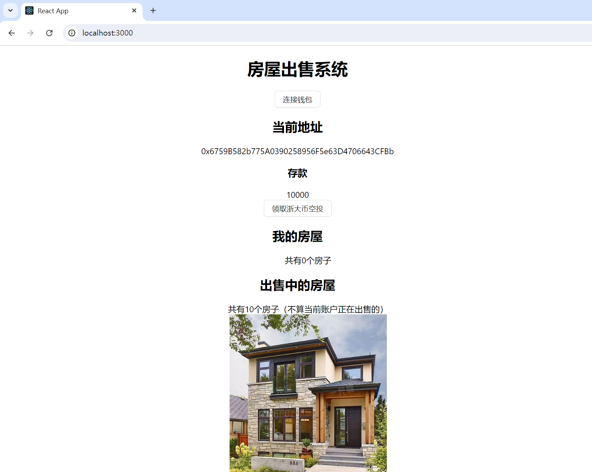
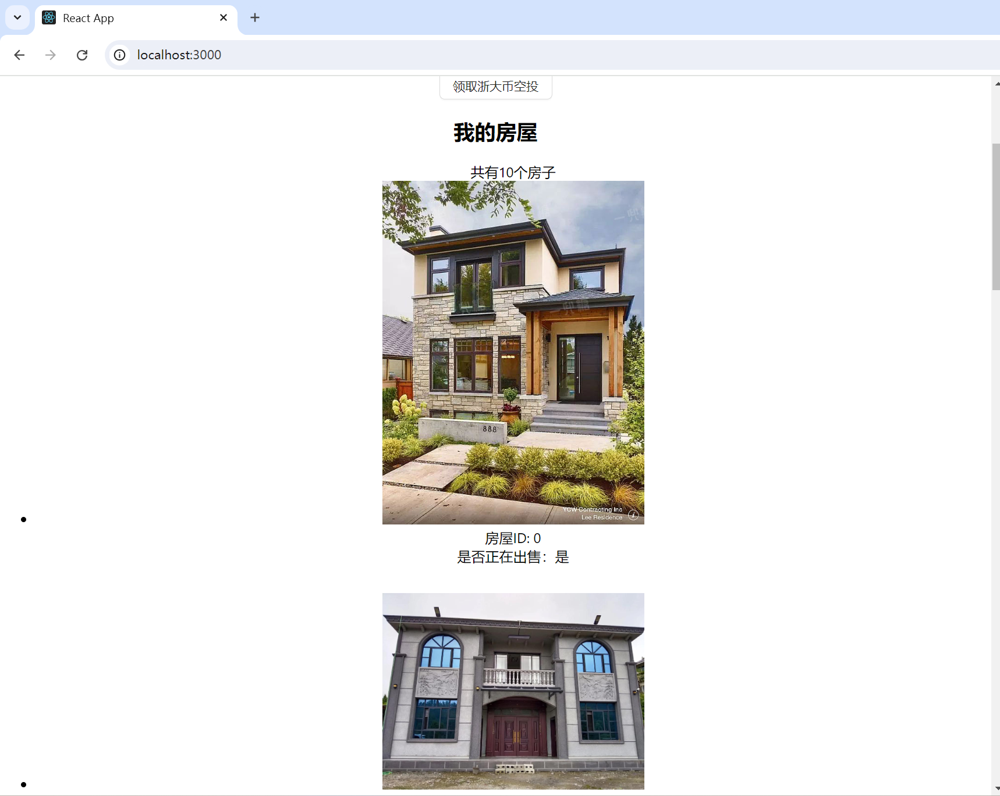
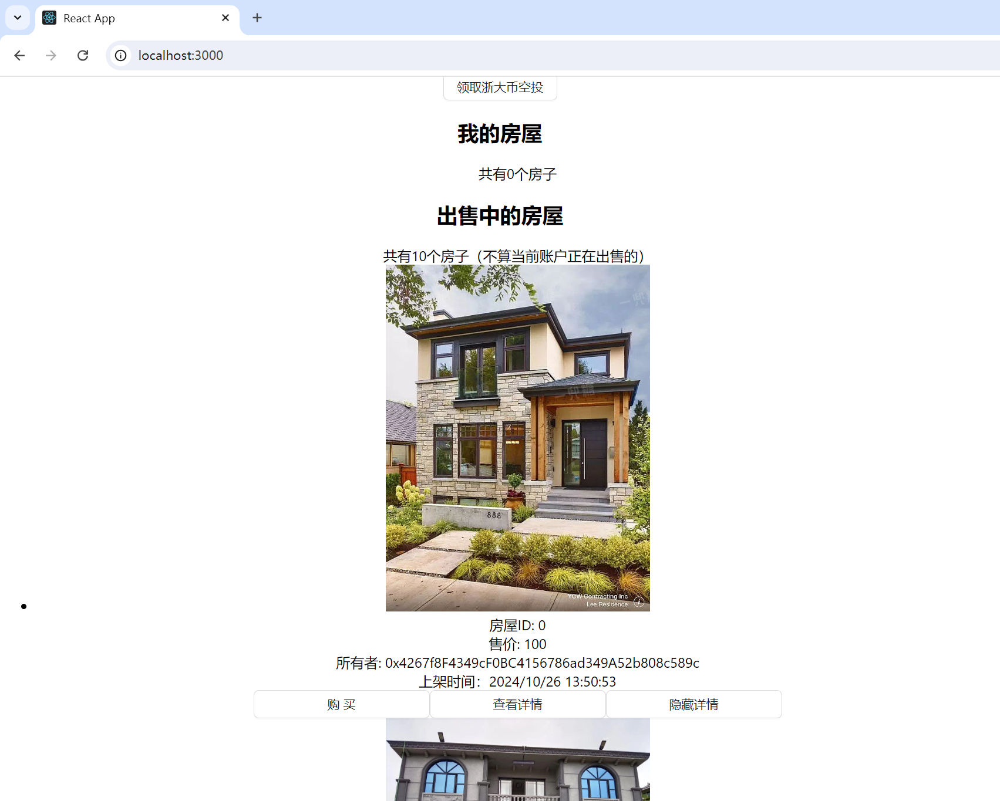
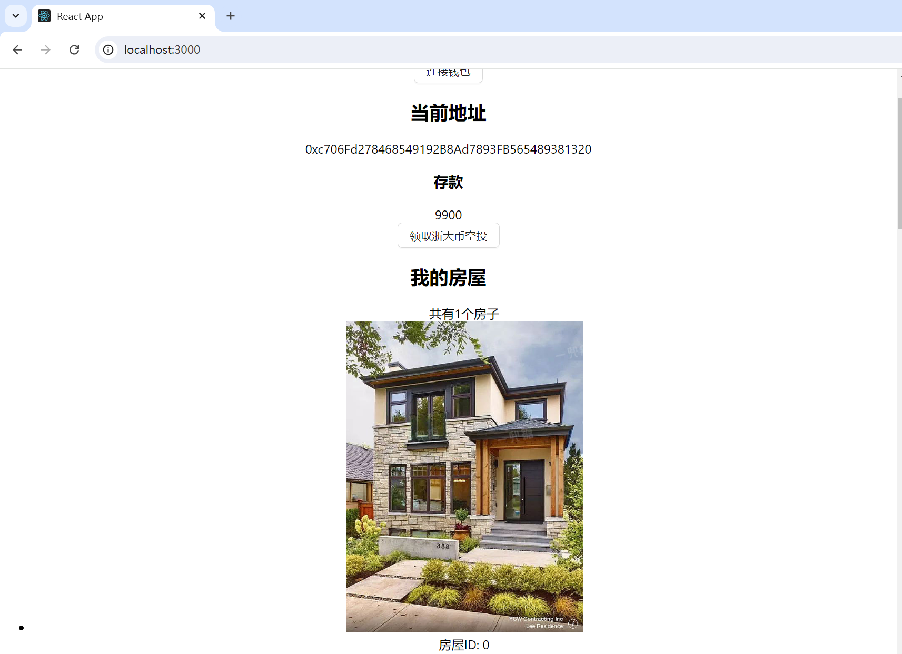
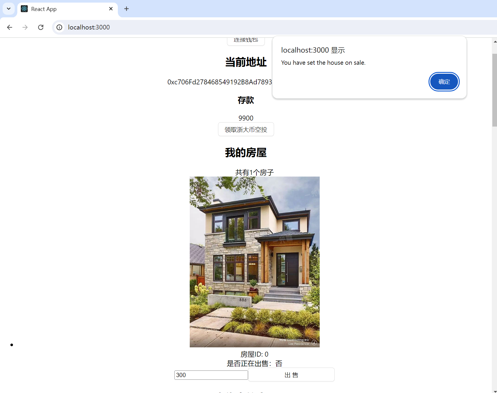
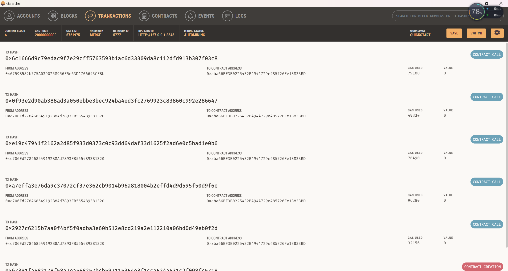

# MyHouseSellingSystem

<!-- ⬆ 可以️修改成你自己的项目名。

> 第二次作业要求（以下内容提交时可以删除）：
> 
> 去中心化房屋购买系统，参与方包括：房屋拥有者，有购买房屋需求的用户
>
> 建立一个简易的房屋出售系统，在网站中：
> - 创建一个（ERC721）合约，在合约中发行房屋集合，每个NFT代表一栋房屋。让部分用户免费领取部分房屋NFT，用于后面的测试。
> - 在网站中，用户可以出售，或者使用测试以太币购买房屋。每个用户可以： 
>  1. 用户查看自己拥有的房产列表。并可以挂单出售自己的房屋（挂单包含价格等信息）。
>  2. 用户查看所有出售中的房产，并查询一栋房产的主人，及各种挂单信息。
>  3. 用户选择支付房屋价格对应的测试以太币，购买某个其他用户出售的房产。购买后房产拥有权应当发生变化。
>  4. 平台收取手续费：在一个房产出售完成时，用户支付的部分测试以太币（=某栋房产在平台上的挂单时长（timestamp）* 固定比例 * 房产价格）应该被转入某个特定账户（如合约部署者）。
      。
> - （Bonus，如果想要完成Bonus，可以直接将功能整合进上述要求中）发行一个（ERC20）合约，允许用户将测试以太币兑换成ERC20积分，并使用ERC20积分完成购买房屋的流程。
> - 请大家专注于功能实现，网站UI美观程度不纳入评分标准，但要让用户能够舒适操作。简便起见，可以在网上找图片代表不同房产，不需要将图片上链。 -->

<!-- **以下内容为作业仓库的README.md中需要描述的内容。请根据自己的需要进行修改并提交。** -->

<!-- 作业提交方式为：**提交视频文件**和**仓库的链接**到指定邮箱。 -->

## 运行
1、在本地启动ganache应用并将端口号改为8545  

2、将ganache的某一个账户的私钥复制到\ZJU-blockchain-course-2024\contracts\hardhat.config.ts中的accounts后。  
3、在./constracts中运行以下命令   
```bash   
    npm install   
    npm hardhat compile   
    npx hardhat run ./scripts/deploy.ts --network development
```   
4、在./frontend中运行以下命令   
```bash   
    npm install   
    npm run start   
```   

<!-- 
补充如何完整运行你的应用。

1. 在本地启动ganache应用。

2. 在 `./contracts` 中安装需要的依赖，运行如下的命令：
    ```bash
    npm install
    ```
3. 在 `./contracts` 中编译合约，运行如下的命令：
    ```bash
    npx hardhat compile
    ```
4. ...
5. ...
6. 在 `./frontend` 中安装需要的依赖，运行如下的命令：
    ```bash
    npm install
    ```
7. 在 `./frontend` 中启动前端程序，运行如下的命令：
    ```bash
    npm run start
    ``` -->

## 功能实现分析

<!-- 简单描述：项目完成了要求的哪些功能？每个功能具体是如何实现的？

建议分点列出。 -->
<!-- > - 创建一个（ERC721）合约，在合约中发行房屋集合，每个NFT代表一栋房屋。让部分用户免费领取部分房屋NFT，用于后面的测试。
> - 在网站中，用户可以出售，或者使用测试以太币购买房屋。每个用户可以： 
>  1. 用户查看自己拥有的房产列表。并可以挂单出售自己的房屋（挂单包含价格等信息）。
>  2. 用户查看所有出售中的房产，并查询一栋房产的主人，及各种挂单信息。
>  3. 用户选择支付房屋价格对应的测试以太币，购买某个其他用户出售的房产。购买后房产拥有权应当发生变化。
>  4. 平台收取手续费：在一个房产出售完成时，用户支付的部分测试以太币（=某栋房产在平台上的挂单时长（timestamp）* 固定比例 * 房产价格）应该被转入某个特定账户（如合约部署者）。 -->
1、用户查看自己的房产   
连接metamask后可以查看自己的房屋（包括房屋的图片、是否正在出售、房屋id等信息）    
2、如果自己的房屋未处于出售状态，可以输入价格然后挂单出售   
3、用户可以查看别人正在出售的房屋并且点击查看该房屋的详情或者点击隐藏该房屋的详情   
4、用户可以支付ERC20代币来购买别人的房屋，手续费为价格*时间/100000，手续费不超过超过价格的一半。将手续费转给manager，将剩余的钱转给房子的拥有者。   
Bonus:   使用ERC20来购买房屋，通过空降的方式给每个用户初始的ERC20，在交易时转给不同的用户。   

## 项目运行截图

<!-- 放一些项目运行截图。

项目运行成功的关键页面和流程截图。主要包括操作流程以及和区块链交互的截图。 -->
##### 成功登录并连接钱包后刷新可以查看自己的余额、账户地址   

##### 点击“领取浙大币空投”可以兑换ERC20   
   
##### 查看自己的房产   
   
##### 查看出售中的房产   
   
##### 查看出售中房产的详情

##### 购买后的结果   

存款减少了100并且房子属于该地址   

房子减少了一个并且存款增加了100   
##### 将自己的房产挂单出售



##### 与本地测试链交互的截图


##### 与钱包交互

## 参考内容

- 课程的参考Demo见：[DEMOs](https://github.com/LBruyne/blockchain-course-demos)。

- 快速实现 ERC721 和 ERC20：[模版](https://wizard.openzeppelin.com/#erc20)。记得安装相关依赖 ``"@openzeppelin/contracts": "^5.0.0"``。

- 如何实现ETH和ERC20的兑换？ [参考讲解](https://www.wtf.academy/en/docs/solidity-103/DEX/)
  
- 如何实现页面刷新时保留上一次的变量的值？    使用localstorage[CSDN.com]   
- react的组件、控制如何使组件有条件的显示等    [csdn.com]

<!-- 如果有其它参考的内容，也请在这里陈列。 -->
